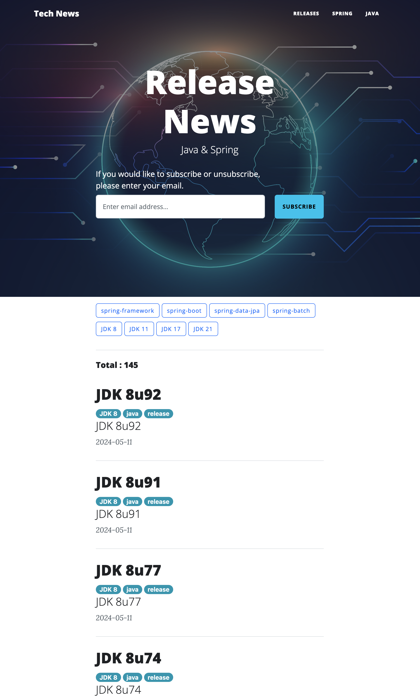
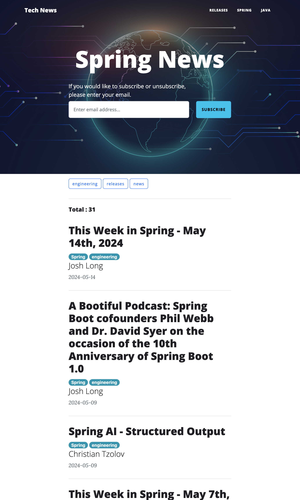
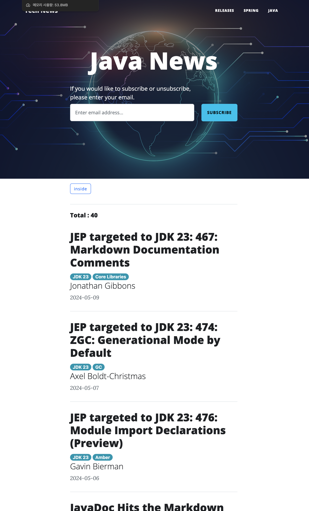
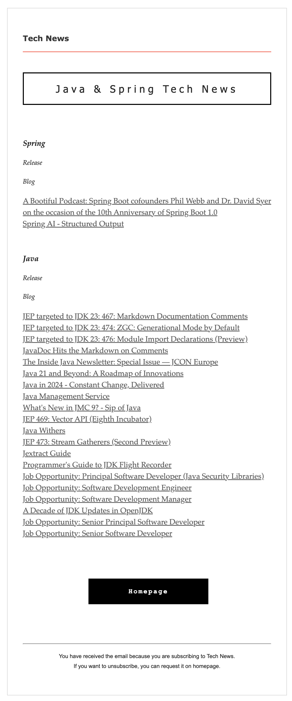

# Tech News

Tech News 는 Java, Spring 의 Releases 정보, Blog 게시물들을 수집하여 홈페이지에 보여줍니다. 
구독을 할 경우 이메일로 새로운 정보나 글들을 공유합니다.

## Tech Stack

- JDK 17
- Spring Boot 3.2.5
- Spring Web
- jsoup 1.17.1
- Thymeleaf
- Junit 5
- Mongodb
- AWS EC2
- Docker

## 주요 기능

### 데이터 수집

Spring Project 의 Release 소식은 [spring-projects](https://github.com/spring-projects) 에서 수집하고 있습니다.

- [spring-framework](https://github.com/spring-projects/spring-framework/releases)
- [spring-boot](https://github.com/spring-projects/spring-boot/releases)
- [spring-data-jpa](https://github.com/spring-projects/spring-data-jpa/releases)
- [spring-batch](https://github.com/spring-projects/spring-batch/releases)

Spring News 는 [Spring Blog](https://spring.io/blog) 에서 수집하고 있습니다.

JDK Release 소식은 [ORACLE](https://www.oracle.com/) 홈페이지에서 LTS 버전(`JDK 8`, `JDK 11`, `JDK 17`, `JDK 21`)을 수집하고 있습니다.

- [JDK 8 Release Notes](https://www.oracle.com/java/technologies/javase/8u-relnotes.html)
- [JDK 11 Release notes](https://www.oracle.com/java/technologies/javase/11u-relnotes.html)
- [JDK 17 Release notes](https://www.oracle.com/java/technologies/javase/17u-relnotes.html)
- [JDK 21 Release notes](https://www.oracle.com/java/technologies/javase/21u-relnotes.html)

Java News 는 [Inside Java](https://inside.java/) 에서 수집하고 있습니다.

> 수집에 포함시키고 싶으신 페이지가 있으시다면 구독 시 발송되는 메일로 페이지 정보를 알려주세요 :)

### 구독

Java, Spring 의 새로운 소식을 구독하고 싶으시다면 
페이지의 헤더에서 `If you would like to subscribe or unsubscribe, please enter your email.` 문구를 찾아주세요. 
발견하셨다면 문구 하단 입력란에 이메일을 입력하시고 구독 버튼을 눌러주시면 구독이 시작됩니다.

## Sample

### Main Page
- Java & Spring Releases News

---

### Spring Blog News

---

### Java Blog News

---

### Mail Subscription Content

